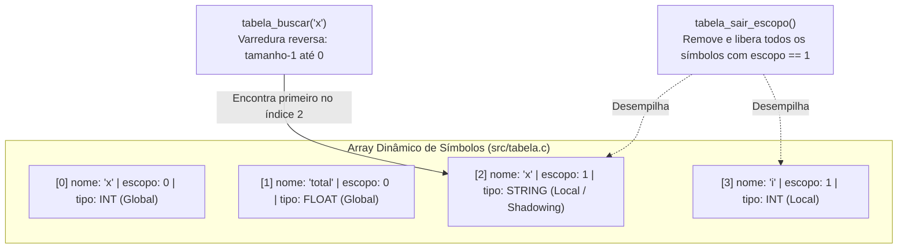
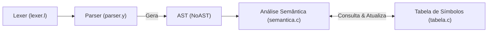

# Tabela de Símbolos

A Tabela de Símbolos é a estrutura responsável por armazenar informações semânticas sobre os identificadores (variáveis e funções) encontrados no código-fonte durante a compilação. Ela atua como a memória do compilador, permitindo a checagem de tipos, o controle de escopos, a resolução de nomes (*shadowing*) e a validação de chamadas de funções.

---

## Estrutura de Dados

### 1. Tipos de Dados (`src/tipos.h`)

Os tipos reconhecidos pelo compilador são definidos pelo enum `TipoDado`:

| Tipo | Constante do Enum | Descrição |
|---|---|---|
| Inteiro | `TIPO_INT` | Valores numéricos inteiros |
| Ponto Flutuante | `TIPO_FLOAT` | Valores numéricos decimais |
| String | `TIPO_STRING` | Textos e literais de string |
| Booleano | `TIPO_BOOL` | Valores lógicos (`True` ou `False`) |
| Void | `TIPO_VOID` | Procedimentos sem retorno explícito |
| Desconhecido | `TIPO_DESCONHECIDO` | Tipo pendente de inferência ou erro semântico |

### 2. Símbolo (`src/tabela.h`)

Cada entrada na tabela armazena os metadados de uma variável ou função:

```c
typedef struct {
    char* nome;
    TipoDado tipo;
    int escopo;
    int linha_declaracao;
    bool e_funcao;
    int num_parametros;
    TipoDado* tipos_parametros;
} Simbolo;
```

* **`nome`:** Identificador da variável ou função (alocado dinamicamente com `strdup`).
* **`tipo`:** Tipo de dado associado à variável ou o tipo de retorno da função.
* **`escopo`:** Nível de aninhamento em que o identificador foi declarado (0 = global).
* **`linha_declaracao`:** Linha do arquivo-fonte onde o identificador foi registrado (para mensagens de erro).
* **`e_funcao`:** Booleano que indica se o símbolo representa uma função (`true`) ou variável (`false`).
* **`num_parametros`:** Quantidade de parâmetros formais esperados pela função.
* **`tipos_parametros`:** Vetor dinâmico com os tipos esperados para cada parâmetro formal.

### 3. Tabela de Símbolos (`src/tabela.h`)

A estrutura que gerencia o conjunto de símbolos e o contexto de execução:

```c
typedef struct {
    Simbolo* array_simbolos;
    int tamanho;
    int capacidade;
    int escopo_atual;
    bool dentro_de_funcao;
    TipoDado tipo_retorno_atual;
} TabelaSimbolos;
```

* **`array_simbolos`:** Array dinâmico contíguo contendo todos os símbolos ativos.
* **`tamanho` / `capacidade`:** Controle de capacidade com redimensionamento automático (`realloc`).
* **`escopo_atual`:** Profundidade do bloco atual (incrementado em blocos e funções, decrementado ao sair).
* **`dentro_de_funcao`:** Flag que rastreia se a análise está dentro do corpo de uma função (usada para proibir `return` fora de funções).
* **`tipo_retorno_atual`:** Tipo de retorno inferido da função em análise, assegurando consistência entre múltiplos `return`.

---

## Mecânica de Escopos e Shadowing

A tabela adota uma organização em **pilha contígua** no array dinâmico. Quando novos símbolos são inseridos, eles são empilhados ao final do array com o valor do `escopo_atual`.



### Resolução de Nomes (*Shadowing*)
A função `tabela_buscar` percorre o array **do final para o início** (`i = tamanho - 1` até `0`). Isso garante que, se uma variável for declarada em um escopo interno com o mesmo nome de uma variável de um escopo externo, a versão mais interna será encontrada primeiro (*shadowing* válido).

### Saída de Escopo
Ao sair de um bloco (`tabela_sair_escopo`), todos os símbolos pertencentes ao escopo corrente são desalocados da memória (`free(nome)`, `free(tipos_parametros)`) e o tamanho da tabela é reduzido até o escopo anterior, evitando vazamento de memória e impedindo o acesso indevido a variáveis locais após o término do bloco.

---

## Operações da API (`src/tabela.h`)

| Função | Descrição |
|---|---|
| `tabela_criar()` | Aloca e inicializa uma nova tabela com capacidade inicial de 10 símbolos e `escopo_atual = 0`. |
| `tabela_inserir(tab, nome, tipo, linha)` | Insere um novo identificador no escopo corrente, duplicando o nome com `strdup` e redimensionando a capacidade se necessário. |
| `tabela_buscar(tab, nome)` | Busca linear reversa pelo identificador. Retorna o ponteiro `Simbolo*` mais recente ou `NULL`. |
| `tabela_entrar_escopo(tab)` | Incrementa `escopo_atual` em 1. |
| `tabela_sair_escopo(tab)` | Remove todos os símbolos do escopo corrente, desaloca suas memórias e decrementa `escopo_atual`. |
| `tabela_imprimir(tab)` | Imprime o conteúdo da tabela e o escopo corrente (útil para depuração). |
| `tabela_liberar(tab)` | Libera recursivamente todos os símbolos alocados e a própria tabela. |

---

## Integração com o Compilador

A Tabela de Símbolos é o elo central entre o Parser, a Análise Semântica e a Geração de Código:



1. **No `main()` (`parser/parser.y`):**
   Após a conclusão bem-sucedida de `yyparse()`, a tabela é criada via `tabela_criar()` e repassada para `analisar_semantica(raiz_ast, tabela)`.
2. **Declaração e Reatribuição Dinâmica:**
   Ao visitar `NO_ASSIGN`, se a variável já existe no escopo atual, seu tipo é atualizado dinamicamente; caso contrário, uma nova entrada é criada com `tabela_inserir`.
3. **Validação de Variáveis e Funções:**
   Ao encontrar `NO_ID` ou `NO_FUNCCALL`, a função `tabela_buscar` verifica a existência do identificador e valida número e compatibilidade de tipos dos argumentos.
4. **Controle de Escopos em Blocos e Funções:**
   Ao visitar `NO_BLOCO` e `NO_FUNCDEF`, a análise chama `tabela_entrar_escopo()` no início e `tabela_sair_escopo()` ao término.

---

## Exemplo de Rastreamento de Símbolos

Considere o seguinte trecho de código em Python:

```python
x = 10

def calcular(val):
    temp = val * 2
    return temp

total = calcular(x)
```

Durante a análise semântica:

1. **Escopo 0 (Global):**
   - Registrado `x` (`TIPO_INT`, escopo 0).
   - Registrado `calcular` (`e_funcao = true`, 1 parâmetro `val`, escopo 0).
2. **Escopo 1 (Corpo da função `calcular`):**
   - Entra no escopo 1 (`tabela_entrar_escopo`).
   - Parâmetro `val` inserido no escopo 1.
   - Variável local `temp` inserida no escopo 1.
   - Validação do comando `return temp` contra `dentro_de_funcao`.
   - Sai do escopo 1 (`tabela_sair_escopo`): `temp` e `val` são destruídos.
3. **Retorno ao Escopo 0:**
   - Variável `total` inserida no escopo 0 com o tipo retornado por `calcular`.

---

## Testes Unitários (TDD)

A integridade da Tabela de Símbolos é validada por testes unitários dedicados em [`testes/tdd/teste_tabela.c`](../testes/tdd/teste_tabela.c), cobrindo:
* Inicialização da tabela e escopos iniciais.
* Inserção e busca simples.
* Resolução de *shadowing* entre escopos aninhados.
* Destruição de variáveis locais ao sair de escopo.
* Redimensionamento automático de capacidade (`realloc`).

Para executar os testes:
```bash
make test_tabela
```

---

## Referências

- Cabeçalho: [`src/tabela.h`](../src/tabela.h)
- Implementação: [`src/tabela.c`](../src/tabela.c)
- Definição de Tipos: [`src/tipos.h`](../src/tipos.h)
- Suíte de Testes: [`testes/tdd/teste_tabela.c`](../testes/tdd/teste_tabela.c)
- Integração Semântica: [`src/semantica.c`](../src/semantica.c)
- Issues relacionadas: #19 (Documentação AST e Tabela de Símbolos)
